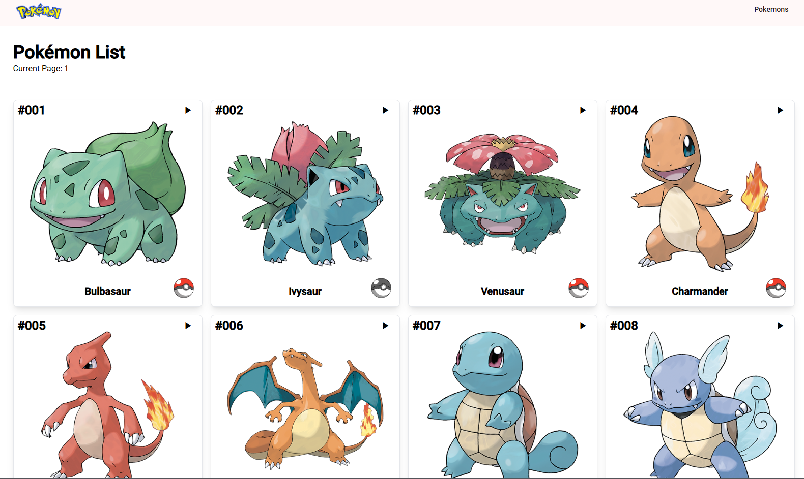

# Pokémon Angular Application

This documentation provides essential information for developers working on the Pokémon Angular application. The project is built using Angular CLI, Tailwind CSS, and Angular Material.

Live demo of the application can be found at [https://angular-ssr-demo-nine.vercel.app/pokemons/page/1](https://angular-ssr-demo-nine.vercel.app/pokemons/page/1).



## Table of Contents

- [Prerequisites](#prerequisites)
- [Installation](#installation)
- [Development Server](#development-server)
- [Building](#building)
- [Server-Side Rendering (SSR)](#server-side-rendering-ssr)
- [Tailwind CSS](#tailwind-css)
- [Generating Prerender Routes](#generating-prerender-routes)
- [Testing](#testing)
- [Project Structure](#project-structure)
- [Additional Resources](#additional-resources)

## Prerequisites

- [Node.js](https://nodejs.org/) (recommended version: 18.x or higher)
- [Angular CLI](https://angular.dev/tools/cli) version 19.1.2 or higher

Install Angular CLI globally:

```bash
npm install -g @angular/cli

```

## Installation

Clone the repository and install dependencies:

```bash
git clone <repository-url>
cd pokemon
npm install
```

## Development Server

Run the development server:

```bash
ng serve
```

Open your browser and navigate to `http://localhost:4200/` to view the application.

## Building

build the application for production:

```bash
ng build
```

The build artifacts will be stored in the dist/pokemon directory.

## Server-Side Rendering (SSR)

To build and serve the application with SSR:

```bash
npm run serve:ssr:pokemon
```

## Tailwind CSS

The project uses Tailwind CSS for styling. Configuration is located in tailwind.config.js:

```javascript
module.exports = {
  content: ["./src/**/*.{html,ts}"],
  theme: {
    extend: {
      animation: {
        "bounce-once": "bounce 1s ease-in-out 1",
        "spin-once": "spin 1s linear 1",
      },
    },
  },
  plugins: [],
};
```

## Generating Prerender Routes

To generate prerender routes, use the following command:

```bash
npm run generate:routes
```

This script generates a routes.txt file containing routes for prerendering.

## Testing

### Unit Tests

Run unit tests using Karma:

```bash
ng test
```

## Project Structure

```
pokemon/
├── public/                 # Static assets (favicon, images)
├── scripts/                # Utility scripts (e.g., generate-prerender-routes.js)
├── src/
│   ├── app/                # Angular components, services, modules
│   ├── [index.html](http://_vscodecontentref_/1)          # Main HTML file
│   ├── main.ts             # Application entry point
│   ├── main.server.ts      # SSR entry point
│   ├── server.ts           # SSR server configuration
│   └── styles.css          # Global styles
├── [angular.json](http://_vscodecontentref_/2)            # Angular CLI configuration
├── [package.json](http://_vscodecontentref_/3)            # Project dependencies and scripts
├── [tailwind.config.js](http://_vscodecontentref_/4)      # Tailwind CSS configuration
└── [tsconfig.json](http://_vscodecontentref_/5)           # TypeScript configuration
```

## Additional Resources

- [Angular Documentation](https://angular.io/docs)
- [Tailwind CSS Documentation](https://tailwindcss.com/docs)
- [Angular Material Documentation](https://material.angular.io/)
